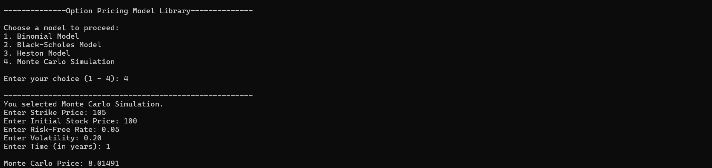

# Option Pricing Models

## What is Option Pricing?

An **option** is a financial derivative that gives the holder the right, but not the obligation, to buy or sell an underlying asset at a specified price (the strike price) on or before a specified date (the expiration date). Options are used by investors for hedging risks and by speculators to profit from price movements.

### Why Price Options?

### 2. Binomial Model
The value of an option depends on several factors:
- **Current price of the underlying asset**
- **Strike price** of the option
- **Time to expiration**
- **Volatility** of the underlying asset
- **Risk-free interest rate**
- **Dividend yield** (for stocks)

Determining the fair value of an option is crucial for traders and risk managers to make informed investment decisions. This is where option pricing models come in.

### Types of Options

- **Call Option**: The right to buy an asset at the strike price
- **Put Option**: The right to sell an asset at the strike price
- **European Option**: Can only be exercised at expiration
- **American Option**: Can be exercised at any time up to expiration

---

## Pricing Models

### 1. Black-Scholes Model

The **Black-Scholes model** is one of the most famous and widely used option pricing models in finance.

**Characteristics:**
- Closed-form analytical solution for European options
- Assumes constant volatility and interest rates
- No dividends (basic version)
- Continuous trading with no transaction costs
- Log-normal distribution of stock prices

**Advantages:**
- Fast computation (simple formula)
- Mathematically elegant
- Provides good approximations for vanilla options

**Limitations:**
- Only works for European options
- Assumes constant volatility (volatility smile/skew observed in reality)
- Not suitable for exotic options

**Best For:** European call and put options on stocks with relatively stable volatility

---

### 2. Binomial Model

The **Binomial model** is a discrete-time approach that models the underlying asset price as moving up or down at each time step.

**Characteristics:**
- Divides time to expiration into discrete periods
- At each step, the asset price can move up (with probability p) or down (with probability 1-p)
- Uses backward induction to calculate option value
- Can handle both American and European options

**Advantages:**
- Flexible: can price American options and early exercise
- Intuitive and easy to understand
- Can incorporate dividends, changing volatility
- Converges to Black-Scholes as the number of steps increases

**Limitations:**
- Computationally more expensive than Black-Scholes
- Discretization error when using fewer steps
- More complex to implement than analytical models

**Best For:** American options, options with discrete dividends, and situations requiring early exercise analysis

---

### 3. Monte Carlo Simulation

The **Monte Carlo method** is a numerical technique that uses random sampling to estimate option prices.

**Formula used**
*stockPriceAtT = initialStockPrice * exp((rate - 0.5 * (volatility * volatility)) * time + volatility * sqrt(time) * Z)*

**Characteristics:**
- Simulates many possible paths of the underlying asset price
- Uses stochastic differential equations (usually geometric Brownian motion)
- Calculates payoff for each path and averages the results
- Discounts back to present value

**Advantages:**
- Extremely flexible: can price complex, exotic options
- Can handle multiple underlying assets and state variables
- Easy to incorporate realistic market features
- Naturally handles path-dependent options

**Limitations:**
- Computationally intensive (requires many simulations for accuracy) *(here we take 100000 simulations)*
- Slower than analytical models
- Requires variance reduction techniques for efficiency
- Discretization error in path simulation

**Best For:** Exotic options, path-dependent options, multi-asset derivatives, and complex payoff structures

---

### 4. Heston Model

The **Heston model** is a stochastic volatility model that addresses one of the major limitations of Black-Scholes.

**Characteristics:**
- Volatility is not constant but follows a stochastic process (mean-reverting square-root process)
- Models the correlation between price and volatility changes
- Captures the volatility smile observed in markets
- Can be solved semi-analytically or via simulation

**Advantages:**
- More realistic modeling of volatility dynamics
- Captures volatility clustering and mean reversion
- Better fit to market prices across different strikes
- Handles volatility smile/skew

**Limitations:**
- More complex than Black-Scholes
- More parameters to estimate
- Computationally more expensive
- Requires more market data to calibrate

**Best For:** Pricing options when volatility changes are important, capturing market-observed volatility smile, more realistic volatility dynamics

---

## Model Comparison

| Feature | Black-Scholes | Binomial | Monte Carlo | Heston |
|---------|---|---|---|---|
| **American Options** | ✗ | ✓ | ✓ | ✓ |
| **Exotic Options** | ✗ | Limited | ✓ | ✗ |
| **Stochastic Vol** | ✗ | Possible | ✓ | ✓ |
| **Speed** | Very Fast | Moderate | Slow | Moderate |
| **Accuracy** | Good | Good | Excellent | Good |
| **Complexity** | Low | Medium | High | High |

---

## Project Structure

This project implements all four models in C++:

- **binomial.h/cpp**: Binomial tree implementation
- **black_scholes.h/cpp**: Black-Scholes analytical solution
- **monte_carlo.h/cpp**: Monte Carlo simulation
- **heston.h/cpp**: Heston stochastic volatility model
- **main.cpp**: Example usage and testing
- **test.cpp**: Unit tests

---

## Getting Started

To build and run the project:
```bash
g++ -o qproject main.cpp header/binomial.cpp header/black_scholes.cpp header/monte_carlo.cpp header/heston.cpp
./qproject
```

